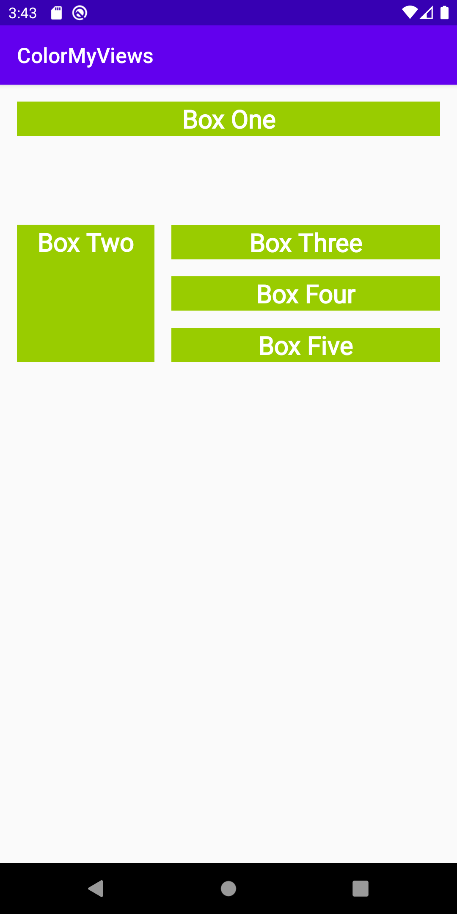
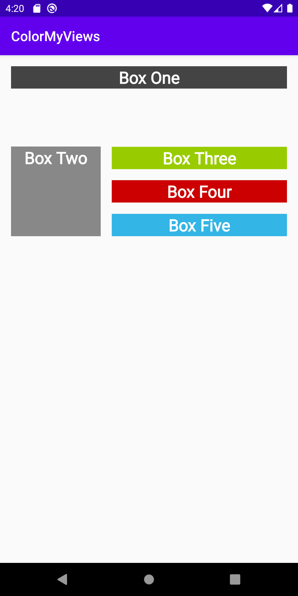
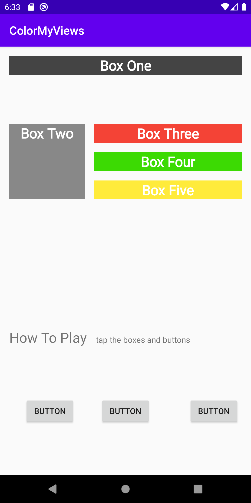

  
  <h3 align="center">ColourMyViews</h3>

  

    Working with types of constraints layouts and building layouts using the layout editor 
   on Android.
     
     
     
    

 

### Table of contents

**1 [About the App](#about-the-app)** 
**2 [General Preview](#general-preview)** 
**3 [Technical](#technical)** 
**4 [Work in Progress](#work-in-progress)** 
**5 [Contributing](#contributing)** 
**6 [LessonsLearned](#lessons)** 
**7 [License](#license)** 
**8 [Versions](#versions)** 
**9 [Contributors](#contributers)** 

:point_down: :point_down: :point_down: :point_down: :point_down:

## Color App
Working with types of constraints layputs and building layouts using the layout editor

## General Preview
#### Screenshots of the app

## Technical
## Permissions

1. Internet - no
2. Browse phone - no

#### Running the project
You can:

    a. clone the project and compile it yourself in android studio(Most up to date)
    b. Run the already compiled version on the(the proect comes with an apk folderwith various apk versions).

### TECHNICAL

#### How to use

**1. Required to run project:**
       ` - To run this project use Android studio 3.* and later. It will be less messy.
         - Gradle version used: gradle 4.0. You can use multiple gradle versions vby having them stored offline. [You can read this to set it up.](www.sth)
        `

**2. Clone this repository :**
 
         `https://github.com/kevinmainairungu/ColorMyViews.git`
         
**3. open Project in Android Studio

**4. Build Project**

**5. Incase of an eror when building project, update your gradle version, Build Tools download**

#### Dependencies

## To Do List

- [x] Adding constraints
- [x] Binding data
- [x] Updating the App to gradle 5.x
- [X] Button for the "change color functionality" functionality

#### CONTRIBUTING
### Assets
* Credit to artists(music,images,gifs...)

### lessonsLearned
##lessons
* [constraint layout](classroom.udacity.com/courses/ud9012/lessons/4f6d781c-3803-4cb9-b08b-8b5bcc318d1c/concepts/6efde730-a337-4d8e-b295-659d116fe9b8).
* [ratios](https://developer.android.com/guide/practices/screens-distribution)
* [chains](https://developer.android.com/training/constraint-layout)
### List of the Contributors on GitHub
* [Contributors](https://github.com/kevinmainairungu/ColorMyViews/graphs/contributors)

### Want to contribute?
I would/ We'd love to have your help in making  **{this app (About me)}** better. The project is still very incomplete, but if there's an issue you'd like to see addressed sooner rather than later, let me(/us) know. 

Before you contribute though read the contributing guide here: [COntributing.md](https://github.com/YourUserNameHere/ColorMyViews/contributing.md)

For any concerns, please open an [issue](https://github.com/kevinmainairungu/AboutMe/issues), or JUST, [fork the project and send a pull request{edit this}](https://github.com/kevinmainairungu/ColorMyViews/pulls) 

## License 
* see [LICENSE](https://github.com/kevinmainairungu/ColorMyViews/blob/master/LICENSE) file

## Versions 
* Version X.Y  DATE 12/2/2019

## Contributers
For personal feedback or questions feel free to contact me via the mail address, which is mentioned on my [Github profile](link (https://github.com/kevinmainairungu). If you have found any bugs or want to post a feature request please use the [bugtracker](https://github.com/kevinmainairungu/ColorMyViews/issues) to report them.

#### Developer/Company
* Homepage:  
* e-mail: 
* Twitter: [@maina_irungu_](https://twitter.com/maina_irungu_ "maina_irungu_")
* other communication channels i.e Social Media, Forum etc

https://contributors-img.firebaseapp.com/

If its open source:

  

Licence is MIT:

